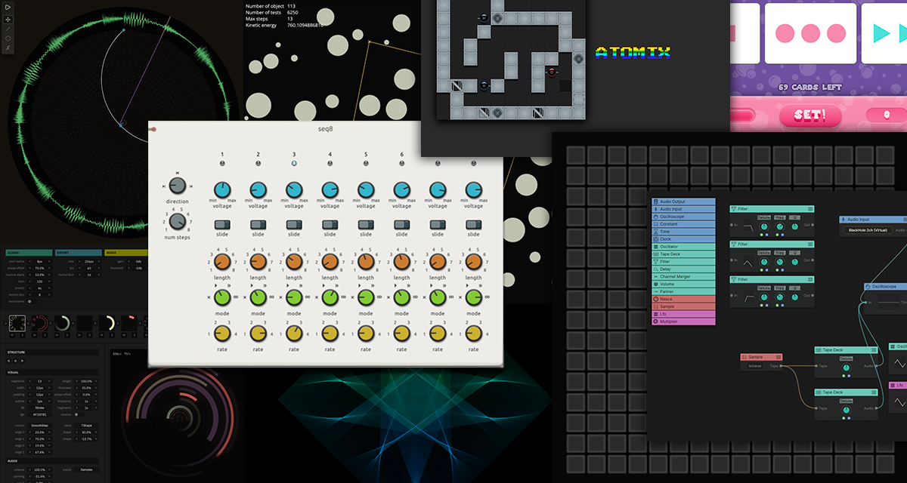

### Hi! It's me, André Michelle

I am originator and co-founder of [audiotool.com](https://audiotool.com), a free online digital audio workstation.

Here you find some of my personal scribbles, fiddles and prototypes. All running inside your browser.

### Shots

### Projects
* [tr-909 🔊](https://github.com/andremichelle/tr-909) | Emulated Roland TR-909 drumcomputer 🧨 
* [malachite audio filter bank 🔊](https://github.com/andremichelle/malachite) | An interative audio eq demo with graphics by [ui mother](https://uimother.com/)
* [circle modulation 🔊](https://github.com/andremichelle/circle-modulation) | Using circles as parameter modulation source
* [rotary 🔊](https://github.com/andremichelle/rotary) | Generation of randomized hud-circles with sound and fx
* [chromaflow 🔊](https://github.com/andremichelle/chromaflow) | An abandoned audio modular system
* [filaments](https://github.com/andremichelle/filaments) | Pretty filaments
* [clash](https://github.com/andremichelle/clash) | Physics engine based on dynamic intersection
* [speech scheduler](https://github.com/andremichelle/speech-scheduler) | Use the [web-speech api](https://developer.mozilla.org/en-US/docs/Web/API/Web_Speech_API) to create spoken turorials with events and user-interaction

### Vintage Flash Ports
* [tonematrix 🔊](https://github.com/andremichelle/tonematrix) | A typescript version of the Tonematrix
* [pulsate 🔊](https://github.com/andremichelle/pulsate) | A soothing audio experiment
* [tonewheels 🔊](https://github.com/andremichelle/tonewheels) | Wheel based sequencer
* [radar 🔊](https://github.com/andremichelle/radar) | Webversion of the loop-radar (Flash on the beach 2009)

### Tooling
* [Web Audio Api | Automator Editor](https://github.com/andremichelle/web-audio-api-automator)
* [Tileset extractor](https://github.com/andremichelle/platforms)
* [XBM Editor](https://github.com/andremichelle/xbm-editor)

### Games
* [atomix 🕹](https://github.com/andremichelle/atomix) | A repainted web-version of the classic C64 puzzle game Atomix | [Youtube](https://www.youtube.com/watch?v=Tgn_2__t9_Y)
* [setera 🕹](https://github.com/andremichelle/setara) | A mutliplayer tablet version of [SET](https://en.wikipedia.org/wiki/Set_(card_game))

### Social
* [LinkedIn](https://www.linkedin.com/in/andremichelle/)
* [Instagram](https://www.instagram.com/ndrmch2l/)
* [Twitter](https://twitter.com/andremichelle)
* [Audiotool](https://www.audiotool.com/user/andremichelle/)
* [Bandcamp](https://andremichelle.bandcamp.com/)
* [SoundCloud](https://soundcloud.com/andremichelle)
* [MixCloud](https://www.mixcloud.com/AndreMichelle/)
