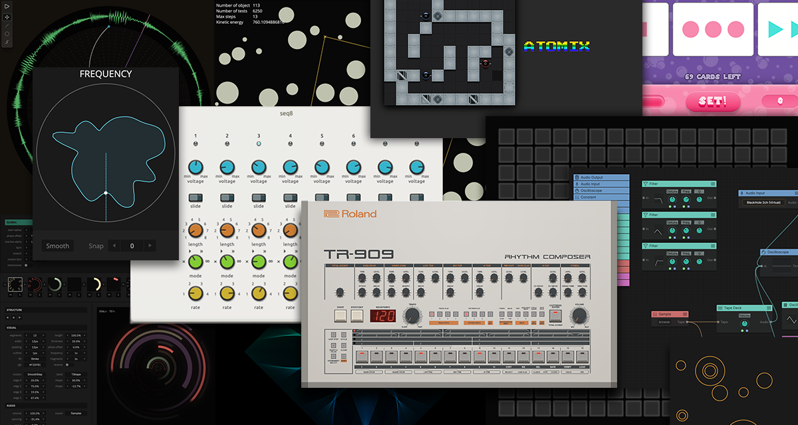

* [tonematrix](https://github.com/andremichelle/tonematrix) | A typescript version of the Tonematrix
* [rotary](https://github.com/andremichelle/rotary) | Generation of randomized hud-circles with sound and fx
* [radar](https://github.com/andremichelle/radar) | Webversion of the loop-radar (Flash on the beach 2009)
* [chromaflow](https://github.com/andremichelle/chromaflow) | An abandoned audio modular system
* [filaments](https://github.com/andremichelle/filaments) | Pretty filaments
* [atomix](https://github.com/andremichelle/filaments) | A repainted web-version of the classic C64 puzzle game Atomix
* [clash](https://github.com/andremichelle/clash) | Physics engine based on dynamic intersection

